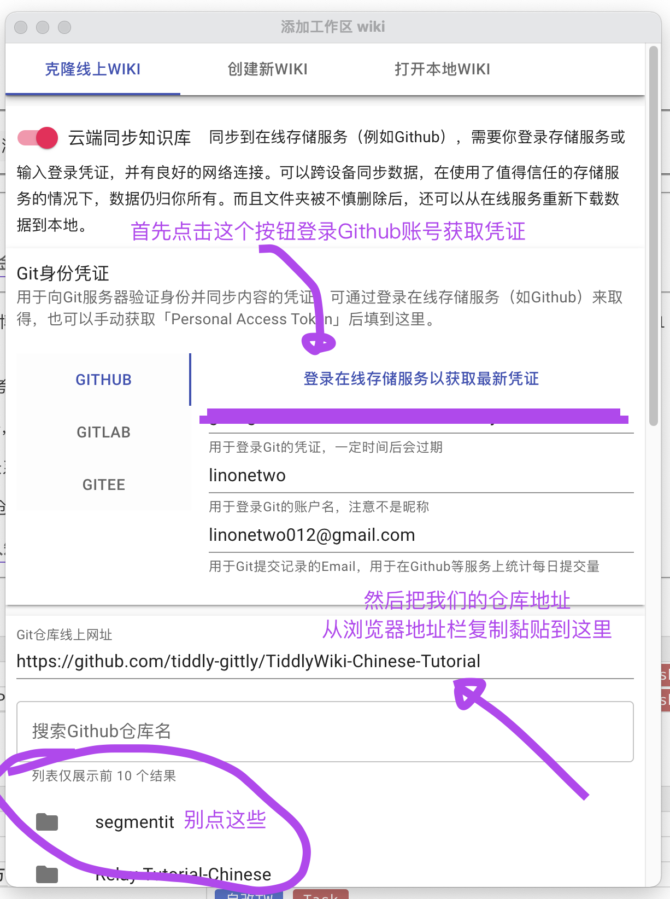
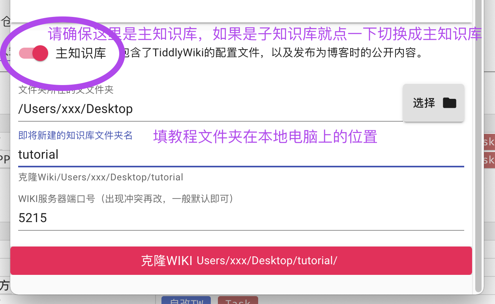
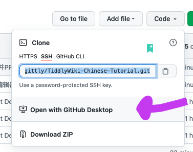
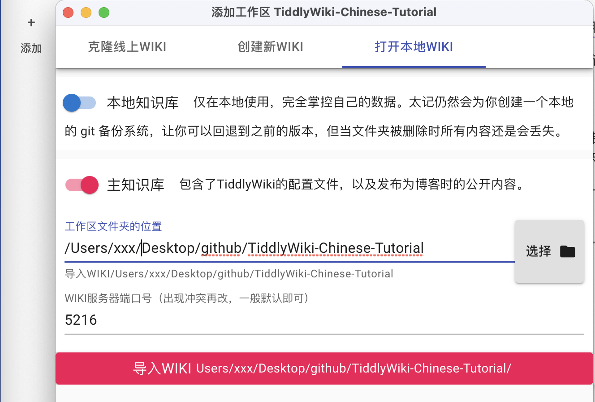
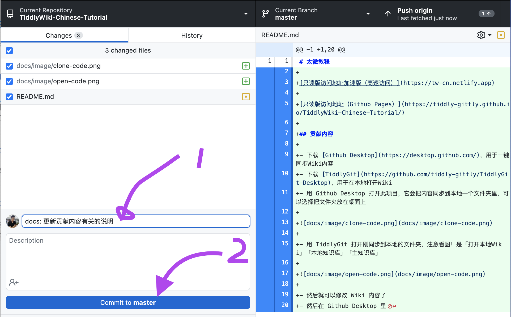
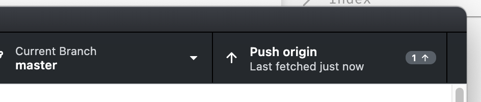
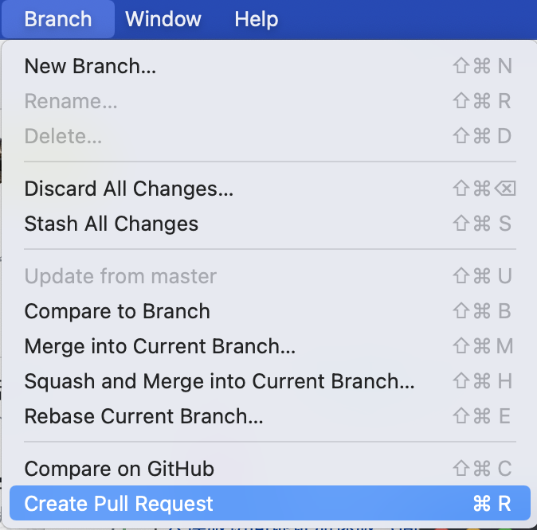

# 太微教程

[只读版访问地址加速版（高速访问）](https://tw-cn.netlify.app)

[只读版访问地址（Github Pages）](https://tiddly-gittly.github.io/TiddlyWiki-Chinese-Tutorial/)

## 贡献内容

### 没有 Github 账号版

使用知乎账号，在 [中文社区共建的太微（TiddlyWiki）教程有哪些需要改进的地方？](https://www.zhihu.com/question/484539250) 里留言。

### 简单版

0. 点击[申请](https://tiddlywiki-chinese-team-invite.herokuapp.com/)加入贡献团队。
1. 下载 [TiddlyGit](https://github.com/tiddly-gittly/TiddlyGit-Desktop)，用于在本地打开和编辑 Wiki
2. 用 Github Desktop 打开此项目，它会把内容同步到本地一个文件夹里，可以选择把文件夹放在桌面上

然后就能编辑了，编辑结果会每 30 分钟自动同步上来，或是在重启应用后自动同步上来。

### 专业版

- 下载 [Github Desktop](https://desktop.github.com/)，用于一键同步 Wiki 内容，它可以用于下载教程到本地文件夹，也可以用于打开本地的教程文件夹，也可以用于一键同步教程文件夹到线上的这个知识仓库里。
- 下载 [TiddlyGit](https://github.com/tiddly-gittly/TiddlyGit-Desktop)，用于在本地打开和编辑 Wiki
- 用 [Github Desktop](https://desktop.github.com/) 打开此项目，用它把内容同步到本地一个文件夹里，可以选择把文件夹放在桌面上

- 用 TiddlyGit 打开刚同步到本地的文件夹，注意看图！是「打开本地 Wiki」「本地知识库」「主知识库」

- 然后就可以修改 Wiki 内容了
- 然后在 Github Desktop 里简要介绍写一下自己这次改了什么，并点击 Commit 按钮

#### 对于简单的文档类改动

直接点击 Push 按钮，提交上来

#### 对于复杂的插件、配置文件改动

- 在菜单里找到 Create Pull Request 按钮，点击它，向社区仓库提交改动申请，大家会通过投票的方式确定是否合并新的内容

- 投票通过且合并之后，你新增的内容就会出现在网站上啦~
