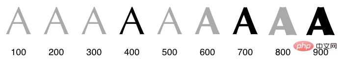

## 队列
- 全部元素（All）
- Concepts 列表
- Topics 列表
- Tasks 列表
- Items 列表
- 待办（Outstanding）队列
	- 待办指 “需要在某一天进行复习” 。如果一个元素被安排在2013年4月13日进行复习，那么自2013年4月13日起，到它被复习的那天为止，该元素都会保持在待办状态。
- 优先级（Priority）队列
- 等待（pending）队列
	- 现在等待队列只用于你从外部来源收到的集合（如高级英语）。
- 记住（Memorized）列表
- 排除（Dismissed）列表
- 链接（Link list）列表
- 神经（Neutral）队列
- 巩固练习队列（Final drill items）。

空白元素，组件

- 组件是被包含在元素里面的功能。
- 模板是预排列放置上组件的元素。

## 元素的组成

- 优先级
- 层级关系（路径）
- 元素类型：concept、 topic、item、task。  
	- topic：T版（表示摘录）、绿色（复习过程）、天蓝色（等待记忆或复习）、黄色（已搁置）
	- item：L版（表示问答）、深蓝色（已记忆）、天蓝色（等待记忆或复习）、黄色（已搁置）
	- concept：灯泡（表示概念）、橙色（复习过程中）、黄色（已搁置）
	- task：红色（表示任务）
- 引用
- 元素编号
- 。。。

## 注册表

- 概念注册表 - 存储集合中创建的所有概念。
- 文本注册表 - 存储集合中使用的所有文本（包括声音文本、RTF 文本、HTML 文本和拼写板文本）。
- 图像注册表 - 存储集合使用的所有图像（例如 BMP、GIF、JPEG、PNG 等）。
- 声音注册表 - 存储集合使用的所有声音（例如 WAV、MID、MP3、RMI 等）。
- 任务列表注册表 - 存储与集合关联的所有任务列表。
- 引用注册表 - 存储集合中使用的所有引用。
- 链接注册表 - 存储集合中创建的所有 [Glossary：Element：Element] 之间的链接。
- 注释注册表 - 存储集合中使用的注释。
- 词典注册表 -  lexicon 存储集合中使用的词语，并保存使用特定词语的文本注册表成员的记录。该注册表可以查找集合中使用的单个单词（图片、OLE 对象等中使用的单词除外）。

- 翻译注册表 - 存储与当前所选翻译语言的文本注册表相对应的翻译文本（工具包 ： 选项 ： 语言 ： 集合翻译）。
- 字体注册表 - 存储可在文本组件中使用的字体。
- 视频注册表 - 存储视频文件。
- 二进制注册表 - 存储您的集合使用的各种文件（DLL、EXE、HLP、XLS、ZIP、DOC、PDF 等）。 
- OLE 注册表 - 存储从其他应用程序（如 Word 文件或 Excel 图表）导入的 OLE 对象。
- 脚本注册表 - 存储集合中使用的所有脚本。
- 样式注册表 - 保存用于格式化 HTML 文本的样式表。
- 音标注册表 - 是唯一一个由两个连接注册表组成的孪生注册表：一个包含单个单词，另一个包含其各自的音标。转录注册表（如果已安装）可从搜索 : 其他注册表 ： 按单词发音（单个单词）或 Search : Other registries ： 按音发音（转录）。您可以通过工具包 : 选项 ： 语言 : 音标

### 词典注册表

搜索：词典（单击以放大）提供的示例性词典注册表：

[img[Pasted image 20231229103754.jpg]]

> _**数字：**词典[注册表](https://help.supermemo.org/wiki/Glossary:Registry)。在图片中，注册表保留了 955,655 个单词。在左侧的顶部面板中，包含单词 abbasid [的集合](https://help.supermemo.org/wiki/Glossary:Collection)中的示例文本。在它下面的面板中，该单词的阿拉伯语音标（展示了 SuperMemo 对 Unicode 的支持）。在底部面板中，带有单词的[文本注册表成员](https://help.supermemo.org/wiki/Glossary:Registry_member)列表。双击列表中的选定成员将在文本[注册表](https://help.supermemo.org/wiki/Glossary:Registry)中打开其相应的条目。_

## 二级存储（辅助存储）

> [!INFO] 
> Tookit - Option - Access - Secondary storage
> 
> 对于任意的注册表均有效

二级存储是将音视频等较大文件，与SuperMemo知识库分隔开的一种方法。目的是减少知识库体积，方便程序备份。辅助存储是您保存大型多媒体文件的位置，您不想将其与收藏整合在一起，以简化备份。

- 二级存储具体是什么？二级存储仅仅是一个含有elements文件夹的文件夹，而非SM集合（收藏集）。例如：`d:\video_elements`二级存储文件夹，此文件夹中就只包含了`elements`文件夹。
	- 注意：不需要创建一个新的集合（收藏集）。如果创建了，那么在这个新集合的注册表中是看不到**管理的收藏集**放置的任意内容的，只能在设置了二级存储的集合的注册表中才可以看到他们。
- `d:\video_elements`二级存储文件夹（可变更此文件夹名称）可以放在任何驱动器或者任意位置中。如果更改了存放路径，且某个集合使用了这个二级存储的话，则需要设置或更改收藏（collection）的二级存储的位置。
- 关于二级存储。例如，您可以将 8 MB 的高级英语 2018 保留在硬盘上，而将 671 MB 的声音保留在外部硬盘上。你需要使用 ==工具 - 选项 - 访问 - 辅助存储==。要备份您的收藏，您只需备份其核心收藏，而将千兆字节不变的声音数据留在外部硬盘上。
- 您可以使用 **注册表中的"工具" - "外部化文件 "** 将文件从主存储移至辅助存储（例如，将大型视频移至外置硬盘）。

==**重要！** 对于管理辅助存储器内容而言的两类不同权限的收藏集 ==
- **管理的收藏集**，收藏集的读写模式辅助存储器：只 有唯一 一个 收藏集可以拥有辅助存储器的读写权限，这意味着导入和外部化等操作必须始终从管理的收藏集进行。
- **只读的收藏集**，收藏集的只读模式辅助存储器：许多收藏集都可以使用一个辅助存储器，这些收藏集必须只能以只读模式使用存储空间（例如，通过链接到文件）。

### 管理辅助存储器
#### Q问题：

你能制作一个关于使用二级存储的视频吗？我收藏了大量视频，不想把时间浪费在备份那些从未改变过的视频上。与此同时，我在视频集中做了很多编辑工作。我每天都会做一些回顾。我需要经常备份。但现在看来这是不可能的，因为收藏的数量太大，而且需要花费大量时间。

#### A回答：

### [在增量视频中管理1tb的二级存储 (SuperMemo 18) - YouTube](https://www.youtube.com/watch?v=oJeNCEG01K8)

1. `d:\video_elements`文件夹中的`elements`文件夹移动到新的存储器的`i:\video_elements`文件夹中
2. 将集合（collection）的辅助存储选项修改为新的位置（`i:\video_elements`）（Tookit - Option - Access - Secondary storage）。
3. 批量导入视频：使用SuperMemo的 File - Import 选择视频文件夹可以批量导入视频。
4. 查看主存储和辅助存储的视频详情，并移动视频到辅助存储文件夹：使用 `Search - Other registeries - Video` 打开视频注册表，然后使用 `注册表上下文菜单（Alt + F10，左上角第一个按钮）- Tools - Size statistics` 查看主存储和辅助存储的视频详情。`注册表上下文菜单- Tools - Externalize files（外部化文件）`可以将位于主存储的视频移动到辅助存储。

该视频展示了一些基本操作，在出于相同原因使用二级存储时，这些操作对增量视频非常有用。如果有帮助，请观看。

基本操作包括

- 向收藏（collection）导入文件（File - Import - 选择视频文件夹）
	- 将 d:\\videos 文件夹中的视频导入到 videos.kno 收藏 (D:)（如果勾选了导入后删除文件，则驱动器 D: 上无需额外空间）
- 设置或更改收藏（collection）的二级存储的位置（Tookit - Option - Access - Secondary storage）
	- 将 收藏（collection） 连接到 4TB 硬盘上的二级存储 (`i:\video_elements`文件夹)
- 移动或备份二级存储文件夹（`d:\video_elements`）（例如移动二级存储文件到新的磁盘）
	- 将视频外置到 4TB 硬盘（将文件从主存储 D: 移动到辅助存储 I:）
- 将文件从主存储移动到二级存储（注册表 - 工具 -  外部化文件）

## SuperMemo样式

- 等线字体：样式表正文(BODY{})字体、回答字体、高亮字体；  
- 宋体字体：界面字体、提问字体、目录字体。

样式文件有两种：卡片包样式和系统默认样式。  “修改样式”的方式-右击-文本-样式。  

- bin/supermem.css 系统默认样式表，BODY{}字段用于定义主窗口窗口Text样式
- systems/卡包文件夹/elements/xx/xx.css 卡包样式表，自定义局部元素样式表。

css字体的设置方法：【font-family】规定元素的字体系列，【font-family】可以把多个字体名称作为一个【回退】系统来保存，如果浏览器不支持第一个字体，则会尝试下一个。  
  
文字的粗细在CSS中通过属性：font-weight设置  
宇体粗细：lighter、normal、bold、bolder
font-weight: normal  

## 配置文件

- bin/layout.ini：布局文件（Layout.ini）是采用绝对布局，所以针对机器的屏幕分辨率保存默认布局配置文件。
- bin/search.ini 配置文件可以自定义搜索引擎，ctrl+ F3 使用。配置文件可以在选择搜索界面恢复默认。
- bin/commands.ini 存储Ctrl+ enter命令列表中的别名
